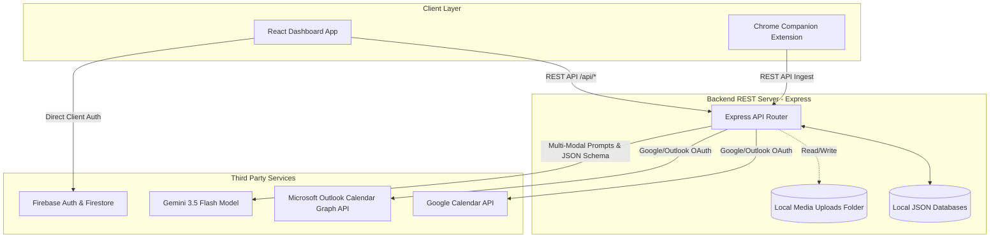

# REZ AI — Technical Documentation (TECHREADME)

Welcome to the technical architecture and specifications blueprint for **REZ AI**, an intelligent corporate memory system and multi-modal meeting companion. 

This document details the underlying technologies, directory organization, operational workflows, and security policies governing the codebase.

---

## 1. Project Directory Structure

Below is the directory mapping of the REZ AI project:

```text
├── .env.example                 # Template for environment variables (API keys, OAuth client IDs)
├── .gitignore                   # Standard Git exclusions (node_modules, local databases, build files)
├── README.md                    # Basic end-user setup and quickstart instructions
├── vercel.json                  # Routing config for Vercel (rewrites all /api requests to Express serverless function)
├── package.json                 # Project dependencies, scripts, and runtime engines
├── package-lock.json            # Version lockfile for npm dependencies
├── bun.lock                     # Lockfile for Bun runtime execution
├── tsconfig.json                # TypeScript compiler choices
├── vite.config.ts               # Vite configuration (sets up React 19 and Tailwind CSS v4)
├── index.html                   # Entry point index file for the Single Page Application (SPA)
├── server.ts                    # Main full-stack Express server (manages APIs, server static folders, and Vite middleware)
├── firestore.rules              # Firebase Security Rules enforcing client-side authorization constraints
├── security_spec.md             # Security specifications & test cases covering the "Dirty Dozen" vulnerabilities
├── firebase-applet-config.json  # Firebase app config parameters used for client-side Auth and Firestore
├── firebase-blueprint.json      # Firestore schema blueprint definitions
├── meetings_db.json             # Local database file storing meeting records (used in local development)
├── calendars_db.json            # Local database file storing calendar settings and events (used in local development)
├── media_uploads/               # Directory where uploaded audio/video files are stored locally
├── public/                      # Static assets served directly by the server
├── api/
│   └── index.ts                 # Serverless api entry point mapping Express requests on serverless deployments
└── src/                         # Front-end React Application source code
    ├── main.tsx                 # Root bootstrapping element mounting React to index.html
    ├── App.tsx                  # Core layout containing page layout, state coordination, and extension distribution
    ├── types.ts                 # Type schemas for meetings, action items, calendar designates, and reports
    ├── firebase.ts              # Firebase Client SDK initializer
    ├── index.css                # Global styles and Tailwind v4 imports
    ├── extension_assets.ts      # Packed source code for the Chrome Companion Extension (manifest, HTML, JS)
    └── components/              # Interactive dashboard UI components
        ├── AuthScreen.tsx       # Auth portal (supports Firebase Authentication and Offline Bypass mode)
        ├── DashboardStats.tsx   # Dashboard statistics cards showing meeting metrics and action checklist progress
        ├── MeetingCard.tsx      # Sidebar navigation cards showing meeting statuses and core metadata
        ├── MeetingDetails.tsx   # Core workspace details displaying AI reports, action items, transcripts, and drafts
        ├── MeetingMemorySearch.tsx # Semantic search query engine querying historical meeting memory
        ├── NewMeetingModal.tsx  # Ingest wizard (options: Simulate via prompt, Upload Audio file, or Record audio live)
        └── CalendarSyncCenter.tsx # Integrates Google / Outlook calendar feeds and toggles automatic join bots
```

---

## 2. Technology Stack

REZ AI is constructed using a robust full-stack architecture optimized for low-latency AI inference, secure authentication, and real-time dashboard updates:

### Frontend
- **React 19 & TypeScript**: Provides declarative components, concurrent rendering features, and type safety across complex data interfaces.
- **TailwindCSS v4**: Incorporates modern styling conventions, leveraging CSS-variable-based theme values and utility classes via `@tailwindcss/vite`.
- **Motion (Framer Motion)**: Empowers components with micro-animations and smooth layout transitions (e.g., modals, expansion states).
- **Lucide React**: Supplies clean, scalable vector icons mapped to visual dashboard parameters.

### Backend
- **Express & Node.js**: Powers the server REST APIs, handles OAuth redirections, reads/writes local databases, and manages multi-modal file uploads.
- **Vite 6 Middleware**: During development (`npm run dev`), Vite runs inside Express as a middleware, offering fast HMR (Hot Module Replacement) and unified port listening (Port `3000`).
- **esbuild**: Used in production packaging to bundle TypeScript server-side scripts down to lightweight Node.js commonjs code.

### AI Engine (Cognitive Memory)
- **Google Gen AI SDK (`@google/genai` v1.29.0)**: Coordinates all requests to the Gemini models.
- **Gemini 3.5 Flash (`gemini-3.5-flash`)**: Used for speech transcription (ingesting raw base64 audio), template-based summarization (generating structured reports, action lists, email/slack drafts), and central semantic question answering.
- **Structured JSON Schema Constraints**: Employs Gemini's native `responseSchema` validation on core REST endpoints to guarantee output conformity to TypeScript interfaces.

### Database & State Storage
- **Local JSON Storage (`meetings_db.json`, `calendars_db.json`)**: Serves as a light, zero-configuration local database for developer environments.
- **Firebase Authentication**: Secures client-side dashboard authentication (Google Identity, Email/Password).
- **Cloud Firestore**: Configured in production configurations to house user meetings. Access patterns are secured strictly via `firestore.rules`.

---

## 3. Application Flow & Architecture

REZ AI links different modules into a cohesive flow. The architecture is represented as follows:



### Key Application Flows:

#### 1. Ingest Flow (AI Simulation & Audio Ingest)
1. **Initiation**: The user triggers an ingest request via [NewMeetingModal.tsx](file:///Users/vinitha/Neurvinch%20product%20/sumai/src/components/NewMeetingModal.tsx).
   - *Simulate Mode*: The user enters a title, category template (Scrum, Client, Interview, Sales, Investor), and optional prompt instructions.
   - *Upload/Record Mode*: The user records audio through their microphone or uploads an audio/video file. The client encodes this binary data into a Base64 string.
2. **Database Initialization**: The client POSTs payload data to `/api/meetings/simulate` or `/api/meetings/upload-audio`. The Express server writes an initial record to the database with a status of `"processing"`.
3. **AI Evaluation (Gemini)**:
   - For simulations, the server issues a detailed instruction prompt to Gemini specifying the template context.
   - For audio files, the server sends the raw Base64 media data along with the prompt as part of a multi-modal query.
   - The server configures the query with `responseMimeType: "application/json"` and binds the `geminiJsonSchema` constraint.
4. **Fulfillment**:
   - Gemini returns structured JSON containing transcription chunks, summaries, action items, and email/slack templates.
   - The server parses the response, maps unique IDs to actions, saves any media files to `media_uploads/`, updates the status to `"completed"`, and writes to the DB.
5. **UI Update**: The client, which polls `/api/meetings` every 3 seconds for active processing items, detects the completed state and updates the dashboard view.

#### 2. Meeting Memory Search Flow (Semantic Question Answering)
1. **Search**: The user inputs a natural language question (e.g., *"What did Vinitha say about the project blockers last Monday?"*) into [MeetingMemorySearch.tsx](file:///Users/vinitha/Neurvinch%20product%20/sumai/src/components/MeetingMemorySearch.tsx).
2. **Context Compilation**: The client POSTs the query to `/api/search`. The Express server retrieves all completed meetings, converts their structures (titles, dates, summaries, transcripts, decisions, and actions) into a single textual context string, and builds a comprehensive system prompt.
3. **Gemini Semantic Synthesis**:
   - Gemini parses the historical records to formulate a markdown answer (`aiAnswer`).
   - It identifies which database meetings are relevant to the query (`meetings`) and extracts direct speech quotes (`citations`).
4. **Resolution**: The structured JSON response is returned, and the dashboard displays the answer while highlighting clickable citations that direct the user to the corresponding meeting file and speaker timestamp.

#### 3. Calendar Integration Flow
1. **Connection**: The user opens [CalendarSyncCenter.tsx](file:///Users/vinitha/Neurvinch%20product%20/sumai/src/components/CalendarSyncCenter.tsx) and requests to connect Google or Outlook calendars.
2. **OAuth Handshake**: For Outlook, the client requests `/api/auth/outlook/url`, prompting an OAuth login page. Upon successful authentication, MS Outlook returns a token to `/auth/outlook/callback`, which uses a `postMessage` event to securely pass the credential back to the main client.
3. **Event Aggregation**: The dashboard fetches upcoming meeting schedules from Google and Outlook APIs.
4. **Auto-Join Registration**: Toggling "Auto-Join" registers that event with `/api/calendars/designations/toggle`. The system keeps track of scheduled bots that can auto-join online huddles.

---

## 4. Security Specifications

REZ AI implements a dual-defense security layout ensuring absolute data isolation, payload sanitation, and transactional progression guarantees.

### Firestore Security Policies (`firestore.rules`)
All direct interactions with production Firestore collections must pass the security validation checks:
- **isSignedIn()**: Asserts that every read or write transaction contains a valid token structure (`request.auth != null`).
- **isVerified()**: Asserts that the authenticated user's email is verified (`request.auth.token.email_verified == true`), mitigating registration abuse.
- **isOwner()**: Asserts that documents in the `/meetings` collection contain a `userId` matching the caller's unique UID (`userId == request.auth.uid`), preventing cross-user scraping.
- **isValidMeeting()**: Enforces standard type checks, checking that incoming payload parameters match defined constraints (string length bounds, valid platform formats, valid templates, etc.).
- **Progressive Locking**: Rules restrict arbitrary mutations. 
  - Completed logs are locked: users cannot overwrite AI summaries or report details.
  - State updates from `completed`/`failed` back to `processing` are blocked.
  - The client is permitted only to mutate the `actionItems` list state (toggling status checkboxes).

### Adversarial Defenses (Audit Compliance)
The system is built to defend against the following vulnerabilities (documented in [security_spec.md](file:///Users/vinitha/Neurvinch%20product%20/sumai/security_spec.md)):

| Threat Vector | Attack Mechanism | Mitigating Control |
| :--- | :--- | :--- |
| **P1: Identity Spoofing** | Forging `userId` field to hijack victim profiles | Rules validate `incoming().userId == request.auth.uid`. |
| **P2: State Fast-forward** | Injecting a pre-completed status to bypass transcription | Rules lock create states; only updates from `processing` are allowed. |
| **P3: Missing Core Invariant**| Deleting the `userId` field to create shadow records | Rules assert schema compliance for all properties. |
| **P4: Unauthenticated Access**| Reading data from an active terminal | Global default `allow read, write: if false` unless logged in. |
| **P5: Path Poisoning** | Injecting traversal sequences `../../` into IDs | Rules validate ID length and assert alphanumeric regex matches. |
| **P6: Temp Email Hijack** | Creating unverified accounts to read databases | Rules enforce verified email states on all mutations. |
| **P7: Value Poisoning** | Sending massive (e.g., 5MB) telemetry strings to exhaust database limits | Explicit field character size constraints check lengths. |
| **P8: Client-Side Update-Gap**| Attacking document states to inject privilege overrides (e.g., `role: "admin"`) | Schema constraints reject extraneous fields via strict schema matches. |
| **P9: Cross-User Scraping** | Omitting UID queries to download third-party data | Rules restrict listing matching logs unless verified by owner queries. |
| **P10: Post-Process Overwrite**| Overwriting generated summaries after completion | Rule filters lock edits on finalized documents. |
| **P11: Empty Parameter Injection**| Injecting empty string fields to break JSON engines | Rules assert minimum string sizes on inputs. |
| **P12: Cross-User Mutate** | MUTATE requests against foreign IDs | Ownership verification checks reject requests on cross-user writes. |

---

## 5. Environment Configuration

To run the application, create a `.env.local` or `.env` file at the root of your project:

```env
# Google Gemini API Access (Mandatory)
GEMINI_API_KEY=your_gemini_api_key_here

# Microsoft Outlook API Integration (Optional for Calendar Sync)
OUTLOOK_CLIENT_ID=your_microsoft_client_id
OUTLOOK_CLIENT_SECRET=your_microsoft_client_secret

# Vercel or Custom Deployment Hosting Address (Defaults to http://localhost:3000)
APP_URL=http://localhost:3000
```

---

## 6. How to Build & Run Locally

### 1. Prerequisite Installations
Ensure you have **Node.js** installed on your operating system.

### 2. Dependency Setup
Install the necessary package sets using `npm` or `bun`:
```bash
npm install
# or
bun install
```

### 3. Run Development Server
Start the local server containing hot reloading configurations:
```bash
npm run dev
# or
bun run dev
```
Open **`http://localhost:3000`** in your browser.

### 4. Build Production Bundle
Compile the front-end SPA bundles and server script files:
```bash
npm run build
```
This builds the client assets inside `/dist` and uses `esbuild` to output a unified server package file at `dist/server.cjs`.

### 5. Start Production Release
Boot the compiled production script using Node.js:
```bash
npm start
```
